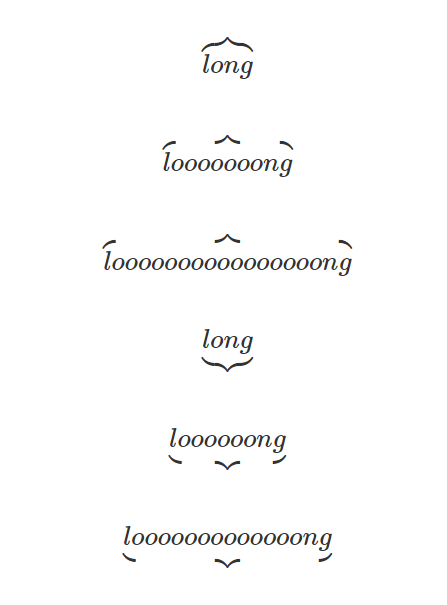
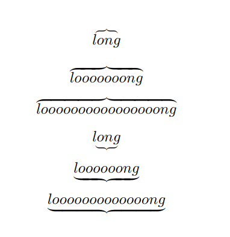

# demo jupyterbook-mathjax-overbrace issue

[jupyter-book/issue1666](https://github.com/executablebooks/jupyter-book/issues/1666)

`\overbrace{}` in markdown LaTeX looks strange generated by `jupyter-book build .`



`\overbrace{}` generated by `jupyter-book build . --builder pdflatex` looks good



[github-pages-link](https://husisy.github.io/demo-jupyterobok-mathjax-issue/)

```bash
OS: win10
python: 3.9.7 (conda)
# jupyter-book --version
Jupyter Book      : 0.12.1
External ToC      : 0.2.3
MyST-Parser       : 0.15.2
MyST-NB           : 0.13.1
Sphinx Book Theme : 0.1.10
Jupyter-Cache     : 0.4.3
NbClient          : 0.5.10
```

install jupyterbook

```bash
pip install jupyter-book
# conda install -c conda-forge jupyter-book
```

build the book locally

```bash
jupyter-book build .
```

build the book using pdflatex

```bash
jupyter-book build . --builder pdflatex
```

view the html page locally `_build/html/intro.html`

push to the github pages

```bash
ghp-import -n -p -f _build/html
```
